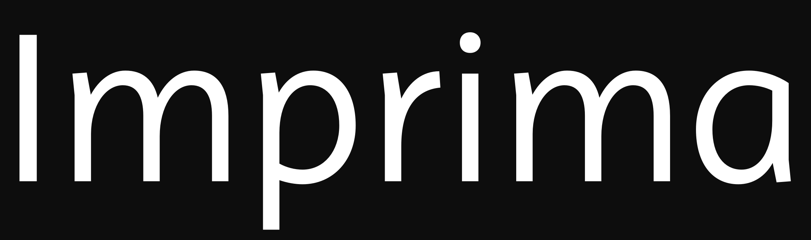

### Imprima

Imprima looks excellent even on cheap home printers because it has broad counters, strong joins between stems and inktraps that enable it to perform well in very small sizes. Professionally printed documents will make it look even better, especially in large sizes, because there the details of its design that are distinctive become clearly visible. The design of this typeface family is cared for as one cares for your own family. Each component has been treated humanely, by hand.

### Designer

* Eduardo Rodríguez Tunni

### License

Licensed under the [*SIL Open Font License, 1.1*](http://scripts.sil.org/OFL); you may not use this file except in compliance with the License.

To contribute to the project contact Eduardo Rodríguez Tunni > edu@tipo.net.ar
